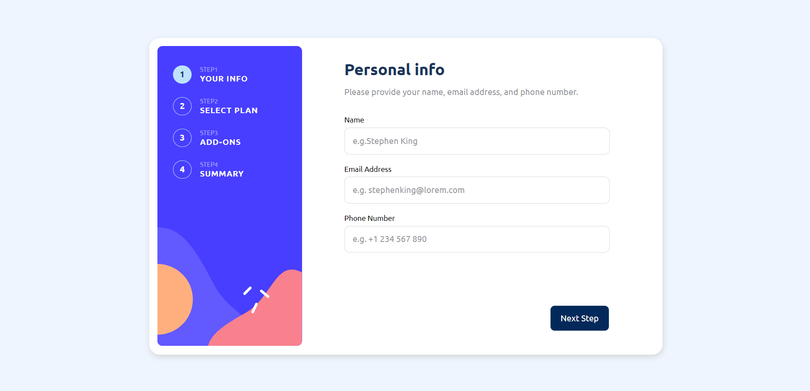
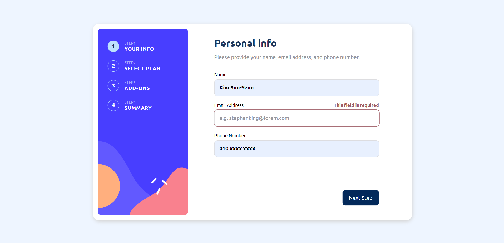
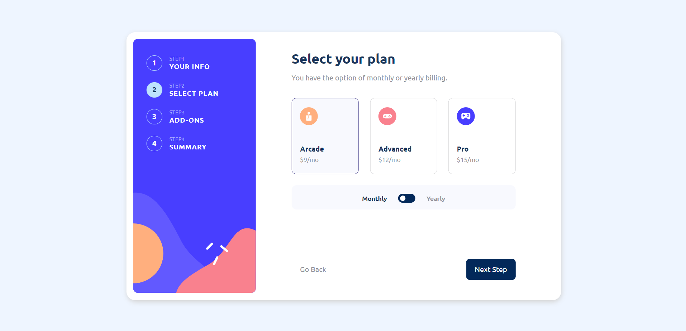
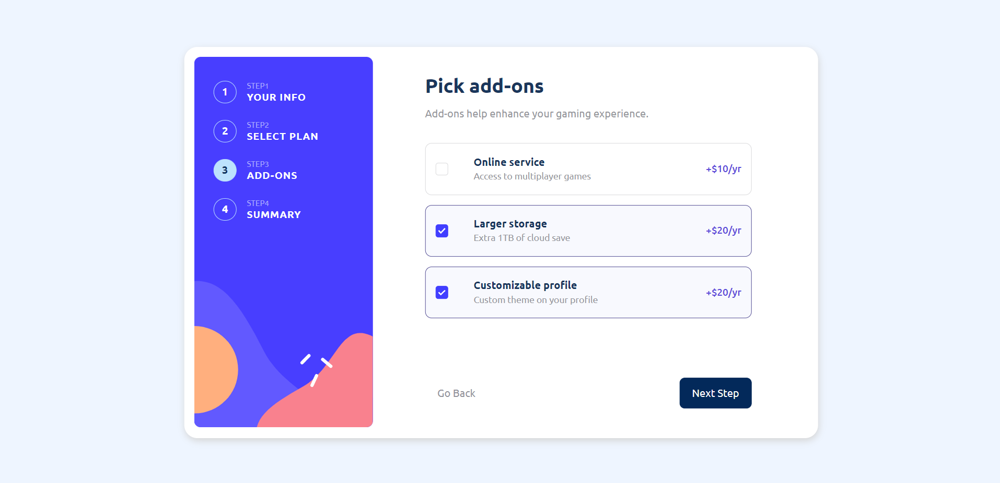
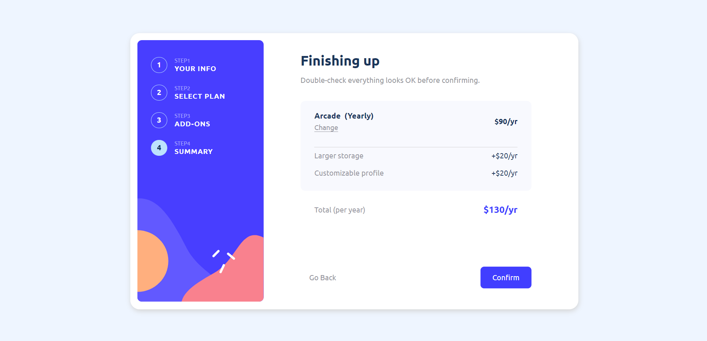
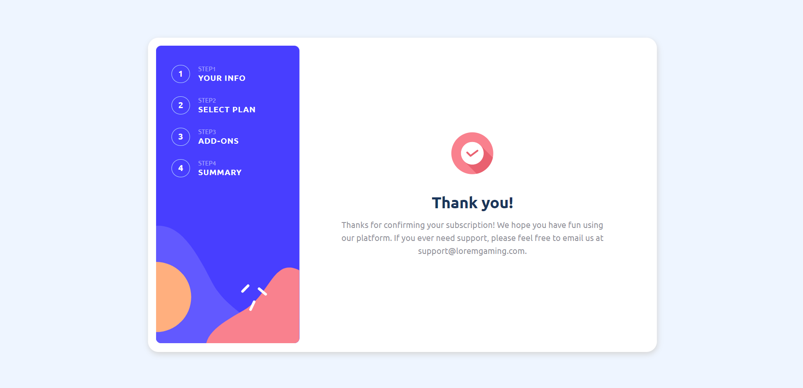
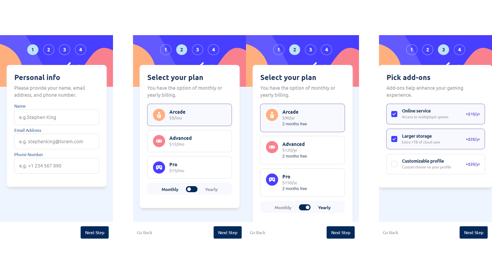
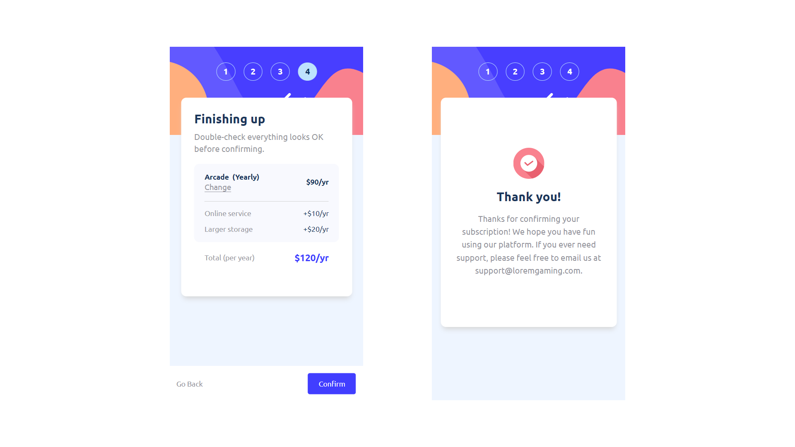

# Multi Step Form

#Typescript #Vue3.x (#Pinia) #SCSS 

Deployment: https://hoijoii.github.io/Multi-Step-Form/

## Desktop

 

:small_orange_diamond: STEP 1

 

:small_orange_diamond: STEP 2

(Monthly)

(Yearly)

 

:small_orange_diamond: STEP 3

 

:small_orange_diamond: STEP 4

 

:small_orange_diamond: Thank you page

## Mobile

 
 